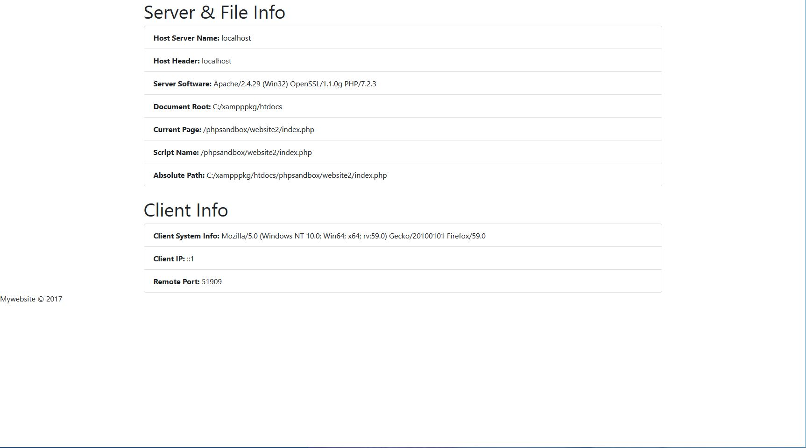
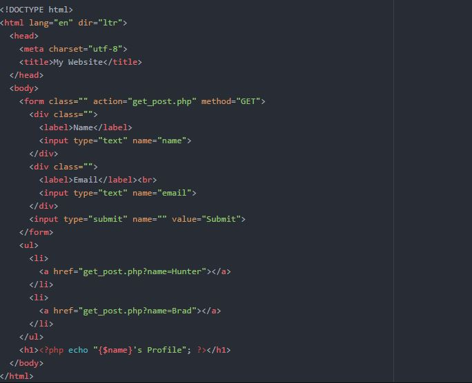

# ServerInfo-AntiSQL-injection
Just a little brushing up on Client, Server &amp; File info with PHP as well as safe form practices.

## First things first!

  So I ran into some bugs back in the day when using XAMPP to render PHP files. They say to use this file path when using XAMPP to
  render but I had an issue with said file path:
  
  ```
  C:\xampp\htdocs
  ```
  You see, my documents would just redirect to the normal dashboard .php file that was the default file within the htdocs directory.
  Instead I went a directory down and selected ```xampppkg```. Reasoning behind this, just because it set that path within Apache's
  ```httpd.config``` file. Now I hope you read this before continuing. If you did and have any issues, just re read this section. On
  to the next one.
  
  ## Second things secondly? 
  
   Next thing to do is to either clone with cmd or just click the fork and or straight download it. Whichever. This is meant as a 
   way to review from basics to further as it is always a must in the Development field. Which is to keep your wits about you and
   try to not forget the basics. We all do that sometimes, I know it's embarrassing even for me. Alright let's dive in.
   
   
   ## First Directory - Website 1
   
   In here I created a server-info.php which has scripts for all the Server & File info as well as the Client-side info. You can use
   this as a base for any project you may have but it's just to review server info code which is important to know. It should look like
   so:
   
   

This, as you can see, states the Host Server Name, Host Header, Software the Server is currently using, Document Roots, Current Page, Script Name and the Absolute Path of the script. Next you can see the client side code where it states the clien system info, in this instance it is bringing up the Browser I am currently using which is stated as:```Mozilla/5.0 (Windows NT 10.0; Win64; x64; rv:59.0) Gecko/20100101 Firefox/59.0 ```.  Next you see the IP as well as the Remote Port that is in use. Pretty simple code. Test it in your browser. Make sure XAMPP is installed and running as administrator. Then do ```localhost/filedirectory/filedirectory2/file.php```. Only put the ```file.php``` at the end if you are trying to render a specific file. 

## Next we have a simple anti SQL injection code
Normally when using GET requests in forms it pushes it to the browser's URL and everyone sees the information. Let's say someone wants to put, I don't know, a script of their own into your form the best practice is to get used to implementing ```isset``` in your if statements like this:


```
<?php
if (isset($_GET['name'])) {
  $name = htmlentities($_GET['name']);
  echo $name;
}
?>
```
then below your form html code. Like so:




We can also go a step further and implement this code segment within the php form for even further protection. This statement is used for basically supporting any driver:

```
$stmt = $pdo->prepare('SELECT * FROM example WHERE name = :name');

$stmt->execute(array('name' => $name));

foreach ($stmt as $row) {
    // do something with $row
}
```
Or use MYSQLi which is basically a class used as a representation of a connection between PHP and MYSQL:
```
$stmt = $dbConnection->prepare('SELECT * FROM example WHERE name = ?');
$stmt->bind_param('s', $name); // 's' specifies the variable type => 'string'

$stmt->execute();

$result = $stmt->get_result();
while ($row = $result->fetch_assoc()) {
    // do something with $row
}
```
Also for error reporting, easiest thing to do is to navigate to your php.ini file and make sure ERROR REPORTING is enabled. If you cannot access that or just want the error of a specific page just implement this piece below:
```
string ini_set('display_errors', '1');
```

Do not set it to 0. Follow this simple key for error reporting:
On = 1
Off = 0

## You are good to go!
Might add some other things as I go along but for now I will leave it at this.
